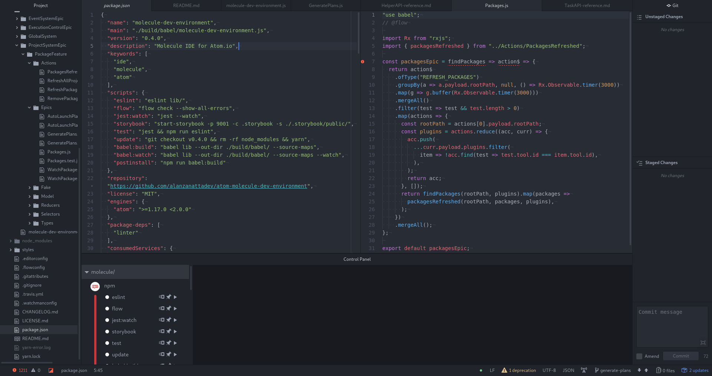

Getting started
===============

What is Molecule?
-----------------

Molecule is a package for the Atom text editor. It transforms Atom into an
[Integrated Development Environment](https://en.wikipedia.org/wiki/Integrated_development_environment)
(or IDE).

What is Atom?
-------------

Atom is a popular text editor. It's free, open source and multi-platform, based
on web technologies.

Its creators describe it as being "a zero-compromise combination of hackability
and usability", as it aims to combine the extensibility of editors like Vim and
Emacs with the convenience of Sublime and Textmate.

More info on [the Atom homepage](https://atom.io/).

Why should I use Molecule?
--------------------------

While Atom is popular because of its intuitive, customizable approach, Molecule
adds to these qualities the expected features of an IDE:

* In-editor compilation
* Code analysis
* Error diagnostics

The key advantage of Molecule over monolithic IDEs is its potential for
adaptation: where most IDEs are only valid for a few programming langages or
environments, developers can easily add plug-ins to Molecule (as Atom packages).
Users are able to download the plug-ins to adapt to new langages, without having
to change their IDE, habits, settings, keybindings, etc.

Installation
------------

1.  **[Install Atom](http://flight-manual.atom.io/getting-started/sections/installing-atom/) version 1.17.0 or higher**

2.  **Install [Watchman](https://facebook.github.io/watchman/)**

3.  **Install Molecule**

    Molecule isn't available on `apm` (the official tool for downloading Atom
    packages) yet. To install Molecule, use the following commands:

    ```
    git clone https://github.com/alanzanattadev/atom-molecule-dev-environment.git
    cd atom-molecule-dev-environment
    git checkout v0.4.0
    npm install
    apm link
    ```

    Molecule should then be installed the next time you start Atom.



### Update

```bash
  cd atom-molecule-dev-environment
  git checkout vX.Y.Z # Where X.Y.Z is the current version number
  rm -rf node_modules
  npm install
```

And reload atom!
